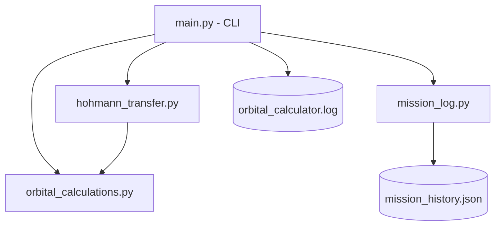
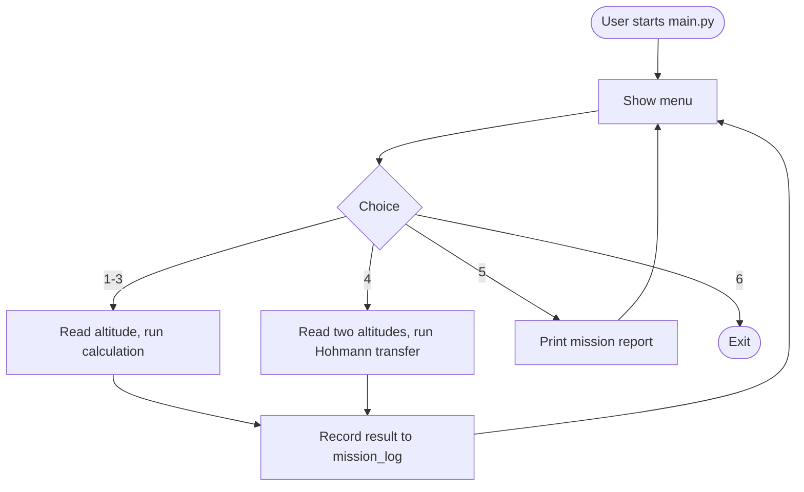

# Orbital Mechanics Calculator

A command-line tool for computing circular orbital velocity, escape
velocity, orbital period, and Hohmann transfers between Earth orbits — with
session logging and a built-in analytics report.

## Overview

Instead of one long script, the calculator is split into three functional
modules (calculations, transfer planning, logging/reporting) that are
orchestrated by a small CLI in `main.py`. See `statement.md` for the full
problem statement and scope.

## Features

- **Orbital Calculations** — orbital velocity, escape velocity, orbital
  period for any altitude above Earth's surface.
- **Hohmann Transfer Planner** — Δv1, Δv2, total Δv, and transfer time
  between two circular orbits.
- **Mission Log & Reporting** — every calculation is saved to
  `mission_history.json` and can be summarized with option 5 in the menu.
- **Input validation & error handling** — negative altitudes, equal
  transfer altitudes, and non-numeric input are all caught with clear
  messages instead of crashing.
- **Logging/monitoring** — all sessions, warnings, and errors are written
  to `orbital_calculator.log` via Python's `logging` module.
- **Unit tests** — `test_calculations.py` covers the core physics and the
  validation logic.

## Technologies / Tools Used

- Python 3 (standard library only: `math`, `dataclasses`, `json`, `logging`,
  `unittest`)
- No external dependencies

## Project Structure

```
orbital-mechanics-calculator/
├── main.py                  # CLI entry point / workflow
├── orbital_calculations.py  # Module 1: velocity, escape velocity, period
├── hohmann_transfer.py      # Module 2: Hohmann transfer planning
├── mission_log.py           # Module 3: history persistence + reporting
├── test_calculations.py     # Unit tests
├── README.md
└── statement.md
```

## System Architecture



## Workflow



## Steps to Install & Run

1. Make sure Python 3.8+ is installed.
2. Clone or download this repository.
3. From the project folder, run:

   ```bash
   python main.py
   ```

4. Use the on-screen menu to run calculations; type `6` to exit.

No installation of external packages is required.

## Instructions for Testing

Run the unit test suite from the project folder:

```bash
python -m unittest test_calculations.py -v
```

All tests should pass, covering orbital velocity, escape velocity, orbital
period, negative-altitude validation, and the Hohmann transfer (including
the equal-altitude error case).

## Screenshots

*(Add a screenshot of the CLI menu and a sample Hohmann transfer run here
before submission.)*

## Non-Functional Requirements Addressed

- **Reliability** — input validation and try/except handling prevent
  crashes on bad input.
- **Usability** — clear numbered menu and formatted, labeled output.
- **Maintainability** — each concern lives in its own module with
  docstrings.
- **Logging/Monitoring** — session activity and errors are logged to file.
- **Scalability** — mission history is append-only and can grow to store
  many sessions' worth of calculations.
- **Performance** — all calculations are closed-form (O(1)), so response
  time is effectively instantaneous.
